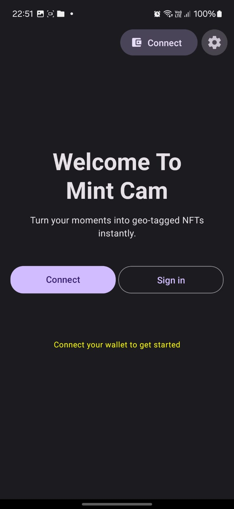
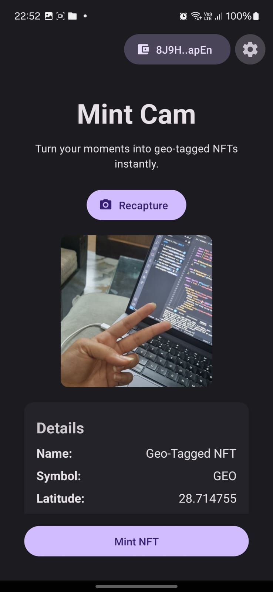
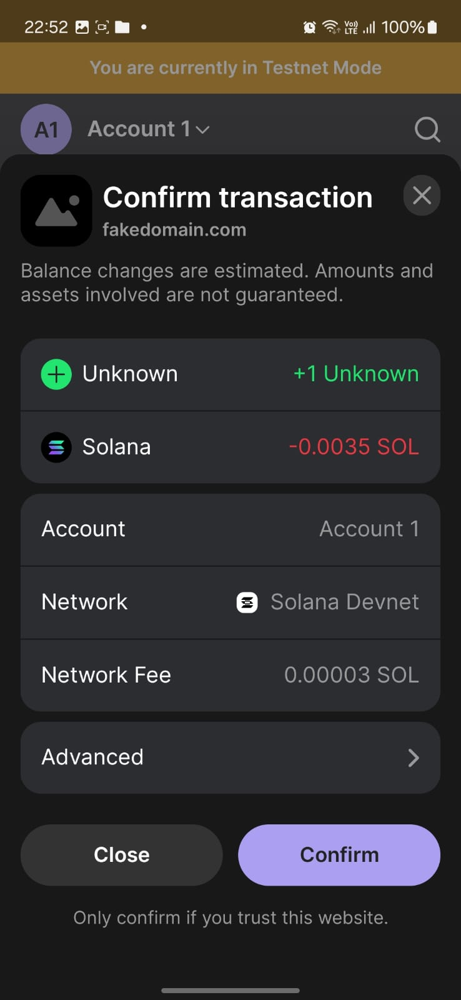
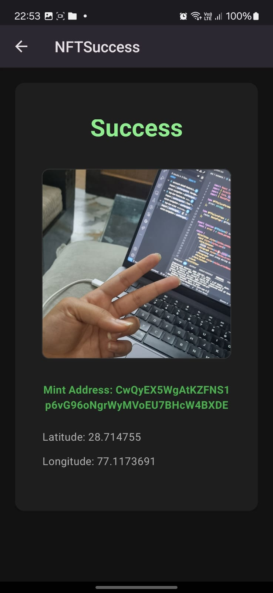
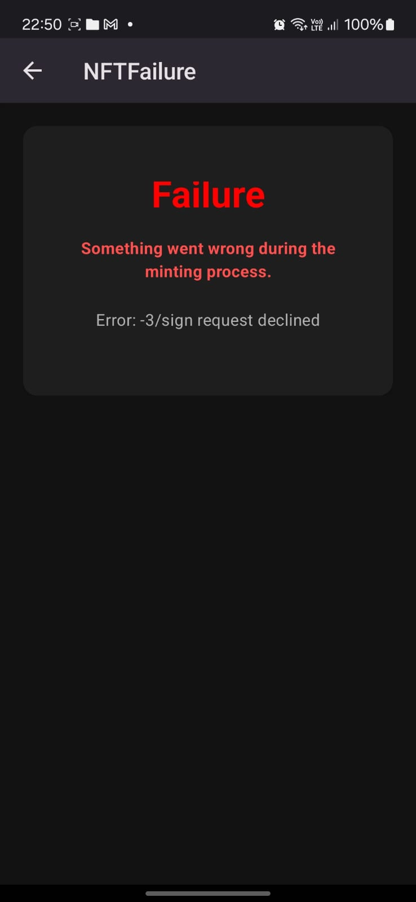

# MintCam

MintCam is an Android application that captures images, mints them as NFTs on the Solana blockchain, and adds geolocation metadata.

DEMO VIDEO: [link](https://www.loom.com/share/7f087ddf80ef4f7e9ff6b4d86e602f81?sid=f1173a1b-f908-450a-ae11-ef3b94afae6b)

## Features

- Image capture using device camera
- NFT minting on Solana blockchain
- Automatic geo-tagging of NFTs
- Solana mobile wallet integration

<table>
  <tr>
  <td align="center">
      
    </td>
    <td align="center">
      
    </td>
    <td align="center">
      
    </td>
    <td align="center">
      
    </td>
    <td align="center">
      
    </td>
  </tr>
</table>

## Tech Stack

- React Native with Expo
- Solana Web3.js
- @solana-mobile/mobile-wallet-adapter-protocol
- expo-image-picker
- expo-location

## Setup

1. Initialize the project:

   ```
   git clone https://github.com/Dksie09/mint-cam
   ```

2. Install

   ```
   yarn
   ```

3. Set up account on Cloudinary and get `CLOUDINARY_URL` and `CLOUDINARY_UPLOAD_PRESET`

4. Run the app:
   ```
   yarn expo run:android --device
   ```

## Development Steps

1. Set up the Expo project using the Solana Mobile template. Read more about it [here](https://docs.solanamobile.com/react-native/expo#running-the-app).

```
yarn create expo-app --template @solana-mobile/solana-mobile-expo-template
```

2. Implement image capture:

   - Use `expo-image-picker` to access the device camera.
   - Store the captured image locally.

3. Implement geolocation:

   - Use `expo-location` to get the device's current location.
   - Store latitude and longitude coordinates.

4. Set up Solana wallet connection:

   - Integrate @solana-mobile/mobile-wallet-adapter-protocol.
   - Implement wallet connection functionality.

5. Implement image upload:

   - Upload captured image to `Cloudinary`.

6. NFT metadata:

   - Prepare metadata including image URL and location data.

7. Implement NFT minting:
   - Use `@solana/web3.js` to connect to the Solana network.
   - Create and send mint transaction using `@solana/spl-token`.

## License

This project is licensed under the MIT License - see the [LICENSE](LICENSE) file for details.
